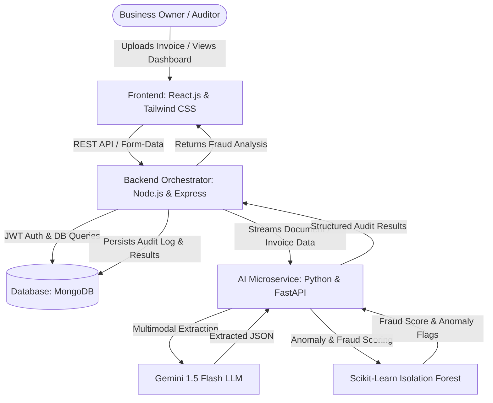

# AuditTrace 🔍⚡

**AuditTrace** is an AI-powered financial auditing platform designed specifically for Micro, Small, and Medium Enterprises (MSMEs). It automatically detects billing errors, duplicate invoices, and vendor fraud by replacing tedious manual ledger checks with state-of-the-art multimodal AI and anomaly detection algorithms.

---

## 📌 Problem & Solution Overview

- **The Problem**: MSMEs lose significant revenue each year to billing inaccuracies, duplicate invoice payouts, inflated pricing, and ghost vendor fraud. Traditional manual auditing is slow, error-prone, and cost-prohibitive.
- **The Solution**: AuditTrace ingests invoices (PDF/images), leverages multimodal LLMs (e.g., Google Gemini 1.5 Flash) to parse unstructured data into structured schemas, cross-references findings against historical vendor records in MongoDB, and runs machine learning algorithms (e.g., Isolation Forest) to instantly flag anomalies and fraud risks with clear explanations.

---

## 🎯 Hackathon Pitch & Judge Evaluation Guide

### 🎤 60-Second Elevator Pitch
> *"Over 82% of small and medium enterprises still verify supplier invoices by hand or not at all — resulting in an estimated 5% revenue loss every year to duplicate billings, rogue price hikes, and ghost vendors. **AuditTrace** completely automates this. A business owner simply drops an invoice PDF or photo; our multimodal AI parses line items with zero configuration, while our Python statistical engine cross-references historical ledger patterns to flag price surges and duplicate charges before payment is issued. We save businesses hours of manual checking and thousands of dollars in averted fraud."*

### 🧪 3-Minute Live Demo Script for Judges
1. **Show Dashboard**: Navigate to `http://localhost:5173`. Point to the 3 High-Impact Cards: **Total Amount Audited**, **Flagged Fraud Prevented**, and **High-Risk Invoices Count**.
2. **Review Seeded Outliers**: Show the real-time feed with red/amber badges showing exact fraud reasons:
   - `INV-TL-105`: Extreme price spike ($14,950 vs $1,280 typical average, Z-score: 3.42 > 2.0).
   - `INV-PLG-404`: Duplicate payment alert (identical $520.00 charged twice).
   - `INV-AWS-881`: Duplicate invoice number detected in ledger.
3. **Test In-Line Auditor Actions**: Click **Approve** or **Reject** on any card to show real-time MongoDB status persistence and instant metric recalculation.
4. **Live Upload Test**: Drag and drop `sample_invoices/2_duplicate_invoice.png` or `3_price_spike_anomaly.png` into the upload zone to demonstrate live Gemini extraction and anomaly flagging.
5. **Searchable Ledger & CSV Export**: Switch to **All Invoices** table, search by vendor, and click **Export CSV** to demonstrate audit compliance.
6. **1-Click Demo Logins**: Click **Sign In** in the top right to demonstrate role-based authentication with pre-configured **Lead Auditor** and **Business Owner** profiles.

### 🔑 Pre-Configured Demo Accounts
| Role | Email | Password |
| :--- | :--- | :--- |
| **Lead Auditor** | `auditor@audittrace.com` | `AuditTrace2026!` |
| **Business Owner** | `owner@acme.com` | `AuditTrace2026!` |
*(Both accounts are also accessible via instant 1-click buttons in the Sign-In modal).*

---

## 🏛 Technical Architecture

To maximize **Technical Implementation** and **Scalability & Future Potential**, AuditTrace employs a decoupled **MERN + Python (FastAPI)** architecture that separates standard web orchestration from specialized machine learning workloads:



### 1. Frontend (`client/`)
- **Stack**: React.js (Vite) + Tailwind CSS + Lucide Icons + Axios
- **Role**: Responsive, intuitive dashboard where business owners upload invoices, inspect extracted line items, view visual fraud indicators, and track historical audit trails.

### 2. Backend Orchestrator (`server/`)
- **Stack**: Node.js, Express, Multer, Mongoose, JWT
- **Role**: Manages authentication, rate limiting, file upload streaming, data routing, business logic, and MongoDB interactions.

### 3. Database (`MongoDB`)
- **Stack**: MongoDB (Atlas or Local)
- **Role**: Stores user accounts, vendor profiles, past invoice records, and detailed audit logs with dynamic JSON structures generated by LLMs.

### 4. AI Microservice (`ai-service/`)
- **Stack**: Python 3.10+, FastAPI, Uvicorn, Google Generative AI (Gemini 1.5 Flash), Scikit-Learn (Isolation Forest), Pandas, NumPy, Pydantic
- **Role**: The core intelligence engine. Parses unstructured invoice files into normalized JSON schemas and runs statistical and machine learning anomaly detection to evaluate fraud risks.

---

## 📁 Repository Structure

```text
AuditTrace/
├── README.md                   # Complete project documentation & pitch guide
├── LICENSE                     # MIT Open-Source License
├── .gitignore                  # Production gitignore rules
│
├── sample_invoices/            # Ready-to-use test assets for live demo
│   ├── 1_valid_invoice.png     # Clean bill -> Approved
│   ├── 2_duplicate_invoice.png # Duplicate bill -> Flags duplicate invoice alert
│   └── 3_price_spike_anomaly.png # Outlier bill -> Flags Z-score price spike
│
├── client/                     # Frontend (React.js + Tailwind CSS)
│   ├── src/
│   │   ├── components/         # Reusable UI components
│   │   │   ├── Navbar.jsx      # Top header with user profile & AI status
│   │   │   ├── Sidebar.jsx     # Navigation sidebar & 1-Click Demo Reset
│   │   │   ├── InvoiceUploader.jsx # Drag-and-drop dropzone with loading spinner
│   │   │   ├── FraudAlertCard.jsx  # Live feed card with Approve/Reject actions
│   │   │   ├── MetricCard.jsx  # High-impact metric summaries
│   │   │   ├── Toast.jsx       # Floating notifications for UI shielding
│   │   │   └── LoginModal.jsx  # JWT modal with 1-Click Demo Logins
│   │   ├── pages/
│   │   │   ├── Dashboard.jsx   # Metrics, uploader & active audit feed
│   │   │   ├── Invoices.jsx    # Searchable & filterable ledger table
│   │   │   └── Analytics.jsx   # Spend & risk distribution bar charts
│   │   ├── services/
│   │   │   └── api.js          # Axios client with automatic JWT injection
│   │   ├── utils/
│   │   │   └── formatters.js   # Currency formatting & CSV export helper
│   │   ├── App.jsx             # Main routing & state container
│   │   ├── index.css           # Tailwind CSS directives
│   │   └── main.jsx            # React root & service worker cleanup
│   ├── index.html              # HTML shell with AuditTrace shield favicon
│   ├── package.json            # Client dependencies & build scripts
│   ├── tailwind.config.js      # Tailwind CSS configuration
│   ├── postcss.config.js       # PostCSS configuration
│   ├── vite.config.js          # Vite configuration with API proxy
│   └── .env.example            # Client environment template
│
├── server/                     # Backend Orchestrator (Node.js & Express + MongoDB)
│   ├── src/
│   │   ├── config/             # DB & Multer upload configurations
│   │   │   ├── db.js           # Mongoose Atlas connection
│   │   │   └── multer.js       # In-memory multipart streaming
│   │   ├── controllers/        # Request handling logic
│   │   │   ├── authController.js # JWT login, register & demo users
│   │   │   └── invoiceController.js # Ingestion, ledger history & reset
│   │   ├── models/             # Mongoose schemas
│   │   │   ├── User.js         # User model with bcrypt password hashing
│   │   │   └── Invoice.js      # Invoice & audit metadata schema
│   │   ├── routes/             # Express API route endpoints
│   │   │   ├── authRoutes.js   # /api/auth endpoints
│   │   │   └── invoiceRoutes.js # /api/invoices endpoints
│   │   ├── seeds/              # Database benchmark seed data
│   │   │   ├── sampleData.js   # 18 realistic invoices definition
│   │   │   └── seedInvoices.js # Standalone seed execution script
│   │   ├── services/           # AI microservice Axios communication relay
│   │   │   └── aiService.js
│   │   ├── app.js              # Express app & route registrations
│   │   └── server.js           # Server bootstrap & MongoDB connect
│   ├── package.json            # Server dependencies & scripts
│   └── .env.example            # Backend environment template
│
└── ai-service/                 # AI & Anomaly Detection Microservice (Python & FastAPI)
    ├── app/
    │   ├── api/
    │   │   └── routes.py       # POST /analyze endpoint
    │   ├── core/
    │   │   ├── gemini_extractor.py # Multimodal Gemini 1.5 Flash extractor
    │   │   └── anomaly_detector.py # Duplicate check & Z-score spike logic
    │   ├── models/
    │   │   └── schemas.py      # Pydantic data models
    │   └── config.py           # Environment settings loader
    ├── main.py                 # FastAPI application entry point
    ├── requirements.txt        # Python package dependencies
    └── .env.example            # AI microservice environment template
```

---

## 🚀 Getting Started

Follow the instructions below to configure and run all three tiers locally.

### 📋 Prerequisites
- **Node.js**: `v18.0.0` or later
- **npm**: `v9.0.0` or later
- **Python**: `3.10` or `3.11`
- **MongoDB**: Local MongoDB instance or free [MongoDB Atlas](https://www.mongodb.com/cloud/atlas) URI
- **Google Gemini API Key**: From [Google AI Studio](https://aistudio.google.com/)

---

### Step 1: AI Microservice Setup (`ai-service/`)

1. Open a terminal and navigate to `ai-service`:
   ```bash
   cd ai-service
   ```
2. Create and activate a Python virtual environment:
   - **Windows (PowerShell)**:
     ```powershell
     python -m venv venv
     .\venv\Scripts\Activate.ps1
     ```
   - **macOS/Linux**:
     ```bash
     python3 -m venv venv
     source venv/bin/activate
     ```
3. Install dependencies:
   ```bash
   pip install -r requirements.txt
   ```
4. Configure environment variables:
   ```bash
   cp .env.example .env
   ```
   Add your `GEMINI_API_KEY` into `.env`.
5. Start the FastAPI microservice:
   ```bash
   python main.py
   # Or using uvicorn directly:
   uvicorn main:app --reload --port 8000
   ```
   *FastAPI will run on [http://localhost:8000](http://localhost:8000) (Swagger Docs at [http://localhost:8000/docs](http://localhost:8000/docs)).*

---

### Step 2: Backend Orchestrator Setup (`server/`)

1. Open a second terminal and navigate to `server`:
   ```bash
   cd server
   ```
2. Install npm packages:
   ```bash
   npm install
   ```
3. Configure environment variables:
   ```bash
   cp .env.example .env
   ```
   Ensure `MONGO_URI` and `AI_SERVICE_URL` are configured.
4. Seed the database with 18 realistic historical invoices (optional but recommended for pitch demo):
   ```bash
   npm run seed
   ```
5. Start the Node.js server:
   ```bash
   npm run dev
   ```
   *Express API will run on [http://localhost:5000](http://localhost:5000).*

---

### Step 3: Frontend Client Setup (`client/`)

1. Open a third terminal and navigate to `client`:
   ```bash
   cd client
   ```
2. Install dependencies:
   ```bash
   npm install
   ```
3. Configure environment variables:
   ```bash
   cp .env.example .env
   ```
   Default `VITE_API_URL` points to `http://localhost:5000/api` (with fallback to `VITE_API_BASE_URL`).
4. Start the Vite development server:
   ```bash
   npm run dev
   ```
   *Access the web application at [http://localhost:5173](http://localhost:5173).*

---

## 🔑 Environment Variables Reference

### Backend Orchestrator (`server/.env`)
| Variable | Description | Default |
| :--- | :--- | :--- |
| `PORT` | Node.js Express server port | `5000` |
| `MONGO_URI` | MongoDB connection URI string | `mongodb://localhost:27017/audittrace` |
| `JWT_SECRET` | Secret key for signing authentication tokens | `your_super_secret_jwt_key` |
| `AI_SERVICE_URL` | Base URL of the Python FastAPI microservice | `http://localhost:8000` |
| `CLIENT_URL` | Frontend URL for CORS configuration | `http://localhost:5173` |

### AI Microservice (`ai-service/.env`)
| Variable | Description | Default |
| :--- | :--- | :--- |
| `PORT` | FastAPI server port | `8000` |
| `GEMINI_API_KEY` | Google Gemini API key for multimodal document parsing | `your_gemini_api_key_here` |
| `GEMINI_MODEL` | Gemini model name | `gemini-1.5-flash` |
| `ALLOWED_ORIGINS` | Comma-separated CORS allowed origins | `http://localhost:5000,http://localhost:5173` |

### Frontend (`client/.env`)
| Variable | Description | Default |
| :--- | :--- | :--- |
| `VITE_API_URL` | Backend Orchestrator base URL (fallback: `VITE_API_BASE_URL`) | `http://localhost:5000/api` |

---

## 📡 API Reference

### Backend Orchestrator (`http://localhost:5000`)
| Method | Endpoint | Description | Auth Required |
| :--- | :--- | :--- | :--- |
| `GET` | `/health` | Healthcheck ping | No |
| `POST` | `/api/invoices/upload` | Ingests PDF/image invoice via Multer & relays to AI microservice | No (Optional JWT) |
| `GET` | `/api/invoices` | Retrieves all audited invoices sorted by date descending | No (Optional JWT) |
| `PATCH` | `/api/invoices/:id/status` | Updates invoice audit status (`Approved`, `Rejected`, `Pending`) | No (Optional JWT) |
| `DELETE` | `/api/invoices/:id` | Removes an invoice record from the database | No (Optional JWT) |
| `POST` | `/api/invoices/reset-demo` | Resets MongoDB to the 18 benchmark demo invoices | No |
| `POST` | `/api/auth/login` | Authenticates user and returns signed JWT token | No |
| `POST` | `/api/auth/register` | Registers a new auditor or business owner account | No |
| `GET` | `/api/auth/me` | Fetches active authenticated user profile | Yes (Bearer JWT) |

### AI Microservice (`http://localhost:8000`)
| Method | Endpoint | Description |
| :--- | :--- | :--- |
| `GET` | `/health` | Microservice health check (`{"status": "ok"}`) |
| `GET` | `/docs` | Interactive Swagger API documentation |
| `POST` | `/analyze` | Accepts multipart invoice file + ledger JSON; returns parsed items & fraud scores |

---

## 🛠 Features & Capabilities

- [x] **Automated Data Ingestion**: Drag-and-drop support for PDF and image invoices.
- [x] **Multimodal AI Invoice Parser**: Zero-shot entity extraction extracting Vendor Name, Tax IDs, Line Items, Subtotal, Taxes, Discounts, and Due Dates.
- [x] **Duplicate Invoice Flagging**: Real-time matching against historical invoice numbers and vendor amount patterns.
- [x] **Anomaly Detection with Machine Learning**: Scikit-Learn Isolation Forest scoring transaction amounts and pricing variations against historical vendor distributions.
- [x] **Audit Trail & Logging**: Immutable logs recording every audit score, confidence level, and discrepancy reason.

---

## 🛡 License
This project is open-source and licensed under the [MIT License](LICENSE).
